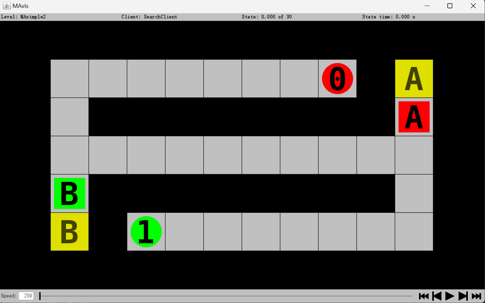
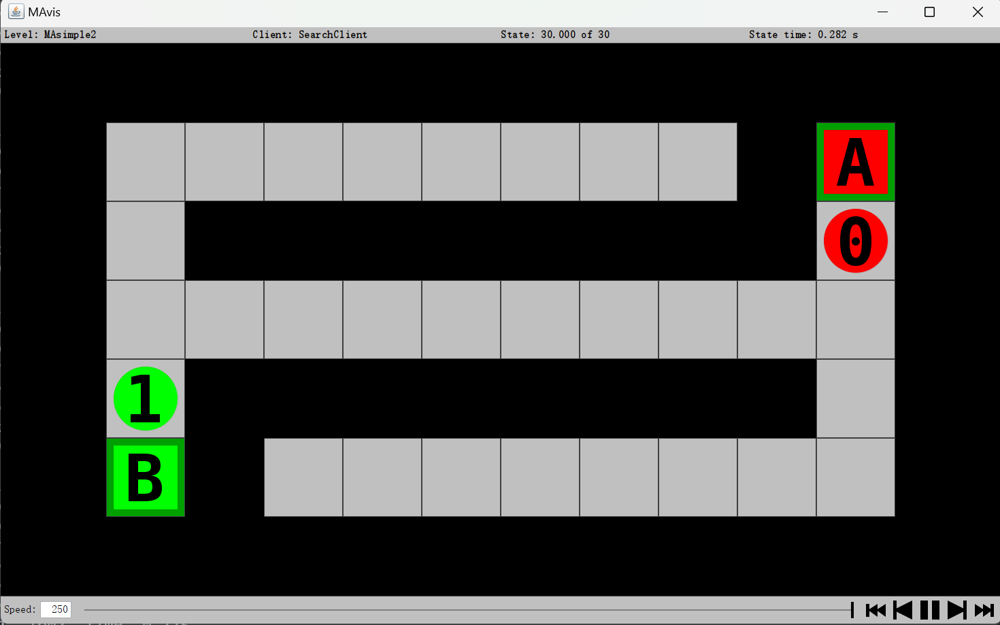
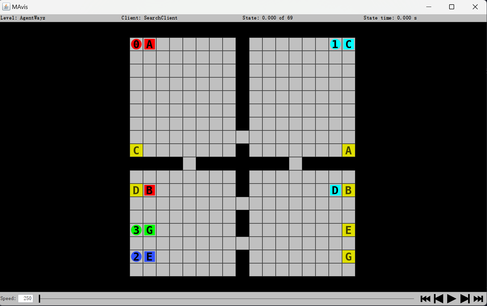
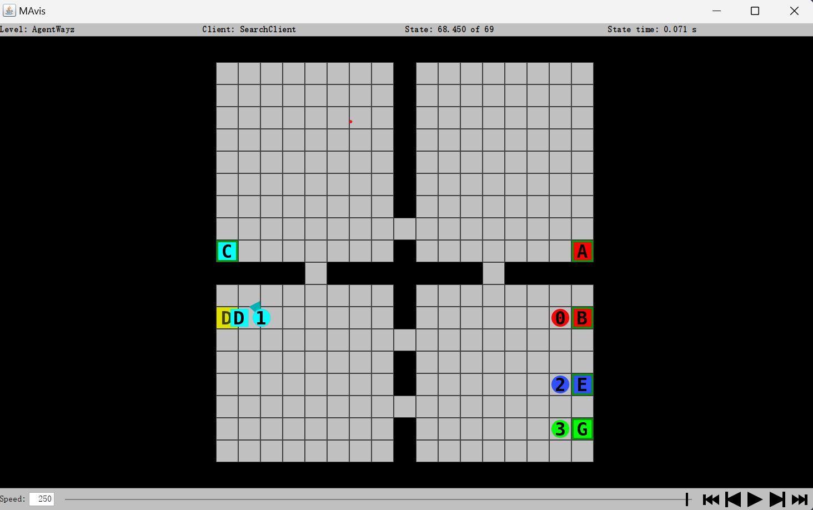

# Intelligent Multi‑Agent System for Hospital Domain

## Feature
- Implemented **conflict-based search**. It consists of high level node for conflict resolving and low level search for single agent planning.
- For low level search, use **astar heuristic search**: *h = goalCounts * 100 - sum of shortest distance between boxes to goals - the minimal distance between agent and its boxes*

## Run
- `java -jar server.jar -c "src/SearchClient.exe -bfs" -l "levels/MAsimple2.lvl" -g`

- `java -jar server.jar -c "src/SearchClient.exe -bfs" -l "levels/AgentWayz.lvl" -g`

