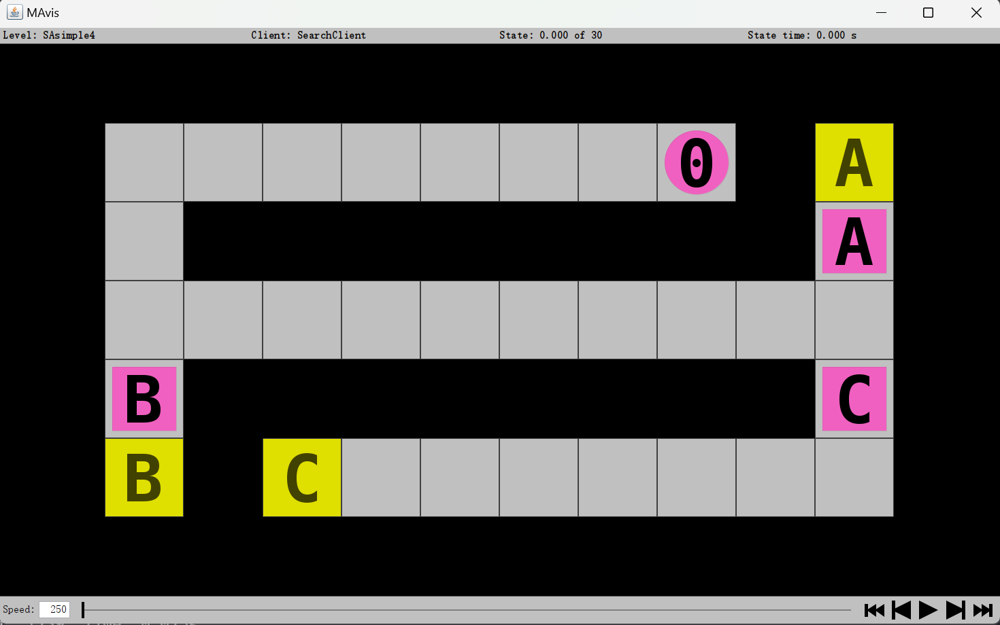

# Intelligent Multi‑Agent System for Hospital Domain

## Feature
- implemented DFS, BFS and heuristic search based on Manhattan distance

- **Manhattan Distance Heuristic:** For each agent, compute the manhattan distance between agent and its goal cell. We could do the preprocessing for every cell in advance and just look it up when running the search, `h[row][col] = |row - goal_row| + |col - goal_col|`.

- option: `-dfs`, `-bfs`, `-astar`, `-wastar`, `-greedy`

## Demo

- single-agent: `java -jar server.jar -c "src/SearchClient.exe -bfs" -l "levels/SAsimple4.lvl" -g`

